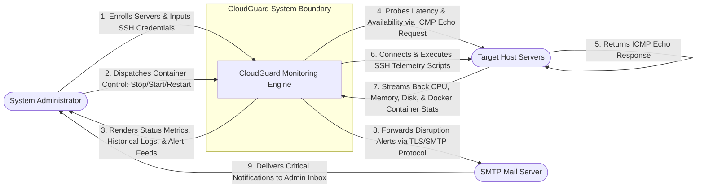
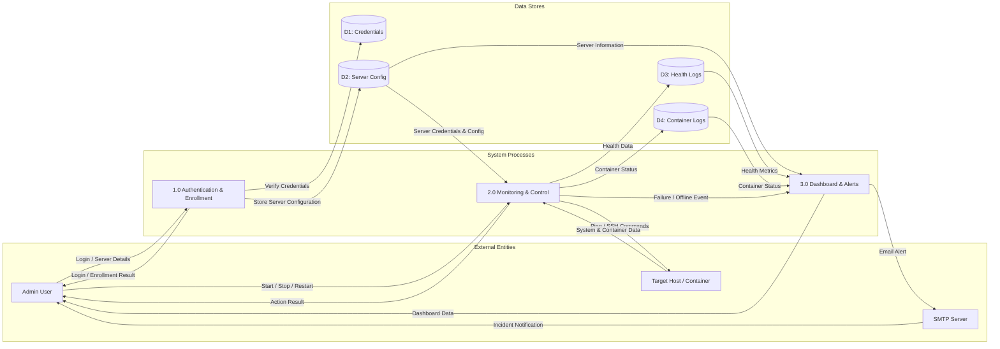
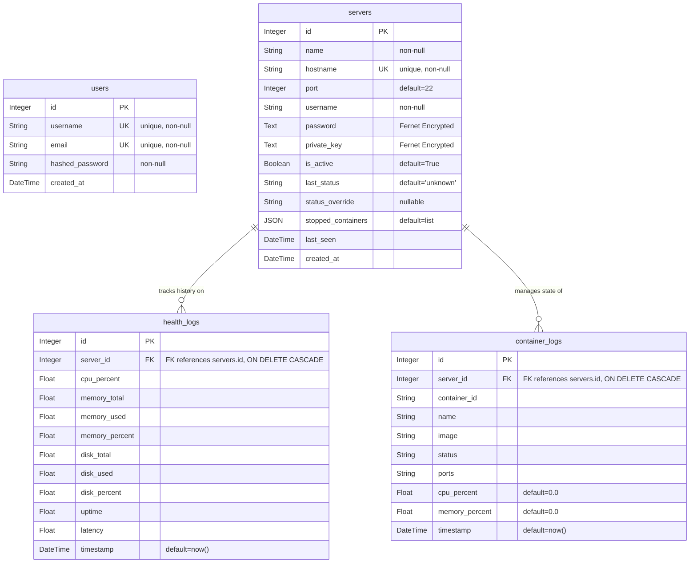

# Chapter 4: System Analysis and Design

This chapter describes the system architecture, component design, data flow patterns, and database layouts for **CloudGuard**, an agentless cloud monitoring and management system.

---

## 1. System Analysis and Design

CloudGuard uses an **agentless monitoring architecture** to gather metrics from remote servers without requiring software installation on the targets. The architecture relies on standard, pre-installed protocols:
1. **ICMP (Ping):** For high-frequency latency and host availability checks.
2. **SSH (Paramiko):** For secure, credential-based remote command execution, allowing the system to query system statistics and Docker status.

### Core Architecture Components
* **Frontend (Next.js Dashboard):** Serves as the user portal, displaying statistics, container lists, incident logs, and credentials settings.
* **Backend API (FastAPI):** Serves database queries, manages server inventory, processes credentials securely using Fernet encryption, and exposes control actions (like starting or stopping containers).
* **Asynchronous Background Worker:** Executes a continuous monitoring loop, running ping checks, initiating SSH connections, parsing remote commands, storing statistics, and triggering incidents.
* **Database (PostgreSQL):** Relational store containing servers, credentials, users, telemetry history, and container states.

---

## 2. Context Diagram (Level 0)

The Context Diagram defines the external boundaries and boundary interfaces of the CloudGuard system.



---

## 3. Data Flow Diagram (DFD)

### 3.1 Simplified Data Flow Diagram (Basic System Logic)

This diagram outlines the core logical process of the automated monitoring cycle:



### 3.2 Detailed Data Flow Diagram (Level 1)

This DFD represents the internal logical processing flow of CloudGuard, tracking data from User Authentication and Host Enrollment, through Telemetry collection and Container Management, to real-time Dashboard rendering and Incident alerting.

```mermaid
graph TD
    %% External Entities
    Admin([System Admin])
    Target([Target Server])
    SMTP([SMTP Mailer])

    %% Database Stores (Individual Tables)
    D1[(D1: Users Table)]
    D2[(D2: Servers Table)]
    D3[(D3: Health Logs Table)]
    D4[(D4: Container Logs Table)]

    %% System Boundary Processes
    subgraph Auth_and_Enrollment [1.0 Authentication & Enrollment]
        P1[1.0 User Authentication]
        P2[2.0 Host Enrollment Vault]
    end

    subgraph Operations [2.0 Monitoring & Control]
        P3[3.0 Telemetry Probing Worker]
        P4[4.0 Container Control Engine]
    end

    subgraph Presentation_and_Alerts [3.0 Visualization & Incident Management]
        P5[5.0 Dashboard Metrics API]
        P6[6.0 Incident Alert Worker]
    end

    %% --- 1. Authentication Flow ---
    Admin -->|1.1 Username & Password| P1
    P1 -->|1.2 Query / Verify Credentials| D1
    D1 -->|1.3 Hashed Match Confirmation| P1
    P1 -->|1.4 Access Token / Session Cookie| Admin

    %% --- 2. Host Enrollment Flow ---
    Admin -->|2.1 Server Config & Host SSH Keys| P2
    P2 -->|2.2 Encrypts Keys & Writes Server Info| D2

    %% --- 3. Telemetry Probing Flow ---
    D2 -->|3.1 Polling Target Credentials & Addresses| P3
    P3 -->|3.2 ICMP Ping & SSH command feeds| Target
    Target -->|3.3 Raw CPU/RAM/Disk & Docker Stats| P3
    P3 -->|3.4 Writes Host Utilization| D3
    P3 -->|3.5 Writes Container Lifecycle States| D4

    %% --- 4. Container Management Flow (Control) ---
    Admin -->|4.1 Action: Stop / Start / Restart| P4
    P4 -->|4.2 Fetch SSH Keys & Credentials| D2
    D2 -->|4.3 Credentials Returned| P4
    P4 -->|4.4 Dispatches SSH docker CLI execution| Target
    Target -->|4.5 Success Status / Error Logs| P4
    P4 -->|4.6 Updates container logs & stopped_containers list| D2
    P4 -->|4.7 Update confirmation message| Admin

    %% --- 5. Dashboard Data Fetch Flow ---
    D2 & D3 & D4 -->|5.1 Read current host & container states| P5
    P5 -->|5.2 JSON Payload for UI graphs & status cards| Admin

    %% --- 6. Alerting Flow ---
    P3 -->|6.1 State Transition Alert (e.g., Host Offline / Container Exited)| P6
    D2 -->|6.2 Fetches SMTP Credentials & Configs| P6
    P6 -->|6.3 TLS Authentication & Email Command| SMTP
    SMTP -->|6.4 Dispatches Incident Alert to Inbox| Admin
```

---

## 4. Entity Relationship Diagram (ERD)

This physical database schema layout details the relationships, entities, fields, data types, and primary/foreign key constraints.



### Table & Entity Schema Details

#### 1. `users` Table
Stores authentication and configuration details of dashboard operators.
* **id (PK):** Unique identity key.
* **username / email (UK):** Unique credentials for authorization and login.
* **hashed_password:** Bcrypt hash of admin passphrase.

#### 2. `servers` Table
Stores the list of all remote host targets in the monitored environment.
* **id (PK):** Unique identifier.
* **hostname (UK):** Probing target. Unique constraint ensures a host is registered only once.
* **password / private_key:** Credentials encrypted at-rest using **AES-128 Fernet tokens**.
* **status_override:** Virtual control field for triggering simulated outages or SSH issues in Demo Mode.
* **stopped_containers:** Tracks container IDs that have been manually stopped via the dashboard.

#### 3. `health_logs` Table (Foreign Key Linked)
Captures host-level performance snapshots.
* **id (PK):** Unique record key.
* **server_id (FK):** Links the snapshot back to the specific parent `servers` entry. Cascades on deletion.
* **latency:** Response delay in milliseconds measured by the ICMP engine.

#### 4. `container_logs` Table (Foreign Key Linked)
Tracks microservice-level status information.
* **id (PK):** Unique record key.
* **server_id (FK):** Links runtime container to its host server. Cascades on deletion.
* **container_id:** Unique Docker instance runtime ID.
* **status:** Current status string (e.g. `Up 12 days`, `Exited (137) 2 hours ago`).
* **cpu_percent / memory_percent:** Active resource metrics collected per microservice.
